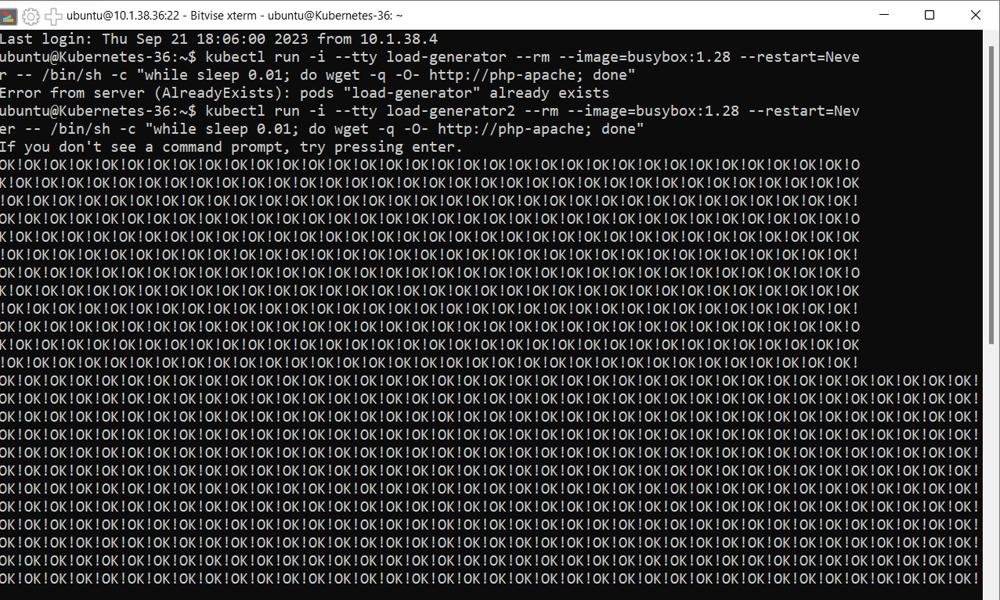
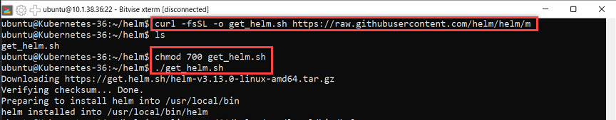

[2_Unterrichtsressourcen/D · main · TBZ-HF-Informatik / modules for students / Cloud Native Technology Vertiefung · GitLab](https://gitlab.com/ch-tbz-hf/Stud/v-cnt/-/tree/main/2_Unterrichtsressourcen/D)
#### [Hauptseite](/README.md)
#### [C - Init container](/aufgaben/C%20-%20Init%20container.md)
# D - Horizontal pod autoscaler

## Deploy a sample application

Um einen HorizontalPodAutoscaler zu demonstrieren, starten wir zunächst ein Deployment, das einen Container mit dem hpa-Beispiel-Image ausführt, und stellen ihn mit dem folgenden Manifest als Dienst bereit:

php-apache.yml erstellen

        $ cat php-apache.yml

Folgenden Code in das yml File kopieren:

        apiVersion: apps/v1
        kind: Deployment
        metadata:
        name: php-apache
        spec:
        selector:
            matchLabels:
            run: php-apache
        template:
            metadata:
            labels:
                run: php-apache
            spec:
            containers:
            - name: php-apache
                image: registry.k8s.io/hpa-example
                ports:
                - containerPort: 80
                resources:
                limits:
                    cpu: 500m
                requests:
                    cpu: 200m
        ---
        apiVersion: v1
        kind: Service
        metadata:
        name: php-apache
        labels:
            run: php-apache
        spec:
        ports:
        - port: 80
        selector:
            run: php-apache

Danach führen wir folgenden befehl aus um dies zu starten:

        $ kubectl apply -f php-apache.yaml

Ausgabe:

        deployment.apps/php-apache created
        service/php-apache created

Erstellt den Container für php-apache

        $ kubectl create deployment php-apache --image=php:7.4-apache -n kube-system

Ausgabe:

        deployment.apps/php-apache created

## Create the Kubernetes service

Zeigt die Version:

        $ kubectl version

Zeigt die Pods im Namespacce kube-system an:

        $ kubectl get pods --namespace kube-system

Erstellt des HorizontalPodAutoscaler:

        $ kubectl autoscale deployment php-apache --namespace kube-system --cpu-percent=50 --min=1 --max=10

Ausgabe:

        horizontalpodautoscaler.autoscaling/php-apache autoscaled

Zeigt die aktuellen Pods im Namespace an:

        $ kubectl get pods --namespace kube-system --show-kind=true

Zeigt die aktuellen hpa im Namespace an:

        $ kubectl get hpa  --namespace kube-system --show-kind=true

## Increase the load:

Als Nächstes sehen wir uns an, wie der Autoscaler auf eine erhöhte Last reagiert. Zu diesem Zweck starten wir einen anderen Pod, der als Client fungiert. Der Container im Client-Pod läuft in einer Endlosschleife und sendet Anfragen an den php-apache-Diens

        # Run this in a separate terminal
        # so that the load generation continues and you can carry on with the rest of the steps
         $ kubectl run -i --tty load-generator --rm --image=busybox:1.28 --restart=Never -- /bin/sh -c "while sleep 0.01; do wget -q -O- http://php-apache; done"

In einem anderen Terminal schauen wir uns den autoscaler an und was hier passier:

         $ kubectl get hpa php-apache --watch

#### [H- Horizontal pod autoscaler](/aufgaben/H-%20Helm%20der%20paketmanager%20für%20Kubernetes.md)
#### [Hauptseite](/README.md)