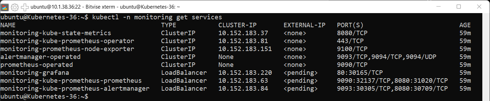
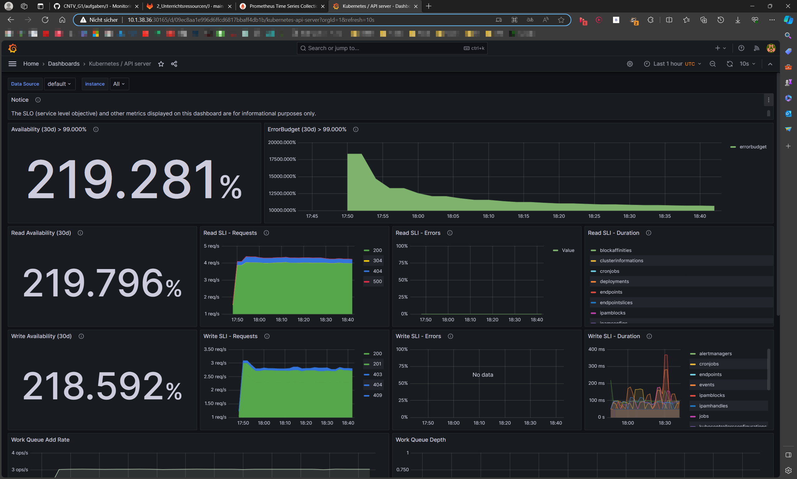
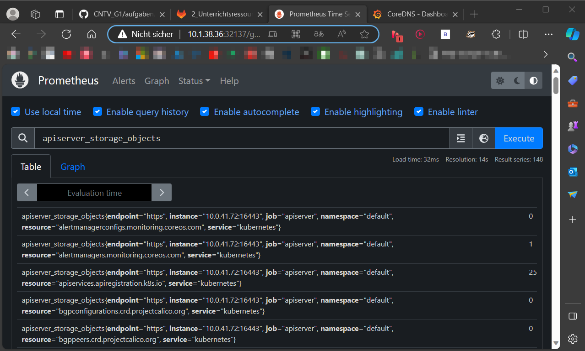

[2_Unterrichtsressourcen/J · main · TBZ-HF-Informatik / modules for students / Cloud Native Technology Vertiefung · GitLab](https://gitlab.com/ch-tbz-hf/Stud/v-cnt/-/tree/main/2_Unterrichtsressourcen/J)
#### [Hauptseite](/README.md)
#### [I - Operator Pattern](/aufgaben/I%20-%20Operator%20Pattern.md)

# J - Monitoring

## Installation

Wir haben die Installation gemäss folgender Anleitung gemacht: [Monitoring Installation](https://gitlab.com/ch-tbz-hf/Stud/v-cnt/-/tree/main/2_Unterrichtsressourcen/J)

Installation
Die Installation des Open Source Monitoring Stack erfolgt am einfachsten mit helm
Dazu erstellen wir zuerst einen eigenen Namespace und verwenden dann das Helm Chart von Open Source Monitoring Stack

    kubectl create namespace monitoring
    helm repo add prometheus-community https://prometheus-community.github.io/helm-charts
    helm repo update
    helm install monitoring prometheus-community/kube-prometheus-stack -n monitoring

Der Open Source Monitoring Stack beinhaltet:

- Grafana
- Prometheus
- Alertmanager

Um auf die UI zugreifen zu können müssen wir die Ports der User Interfaces, von auf ClusterIP auf LoadBalancer ändern:

    kubectl -n monitoring patch service monitoring-grafana                      -p '{"spec": {"type": "LoadBalancer"}}'
    kubectl -n monitoring patch service monitoring-kube-prometheus-prometheus   -p '{"spec": {"type": "LoadBalancer"}}'
    kubectl -n monitoring patch service monitoring-kube-prometheus-alertmanager -p '{"spec": {"type": "LoadBalancer"}}'

Mit folgenden Befehl, können wir die weitergeleiteten Ports herausfinden:

    kubectl -n monitoring get services

Grafana UI Einloggen

- User: admin
- Passwort: prom-operator

In der Prometheus Oberfläche kann mittels der Abfragesprache PromQL gezielt Ressourcen ausgewählt werden, z.B. durch Query von `apiserver_storage_objects`.

Webseiten:

- [Prometheus](http://10.1.38.36:32137)
- [Grafana](http://10.1.38.36:30165)

#### [Hauptseite](/README.md)